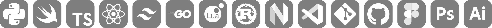

<h3 align="left">self-taught* creator of stuff online.</h3>

-   currently working on [TDB](https://www.tdb.fyi/) - a Tesla "database" app, a lot like MacTracker.

-   primarily `TypeScript` (`React`), and `SwiftUI`. TODO: `Go`, `Lua` and `Rust`.

-   writing [kata](https://github.com/956MB/Kata) in `Python`. learning `Neovim` plugin dev: [ncks.nvim](https://github.com/956MB/ncks.nvim)

-   frequently prototypes and messes around in **`Figma`, `Photoshop` and `Illustrator`**.

-   also draws new languages and posts them on [Reddit](https://www.reddit.com/user/bauera5) sometimes.

-   puts all projects, designs and hobby stuff on [https://www.956mb.com/](https://www.956mb.com/)

-   can be reached at **bays@956mb.com**

---

